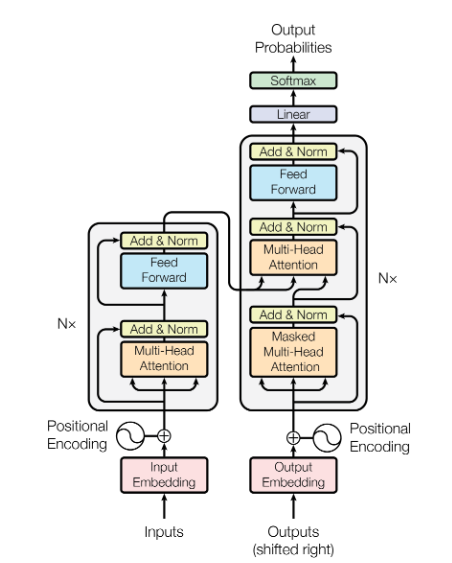

# Transformer From Scratch

A from-scratch PyTorch implementation of the Transformer model introduced in [*Attention Is All You Need*](https://arxiv.org/abs/1706.03762). Trained on the OPUS Books dataset for **English → Italian** machine translation.

## Overview

This project implements every component of the original Transformer architecture directly in PyTorch, without relying on high-level NLP libraries for the model itself. Key components include:

- **Input Embedding** with $\sqrt{d_{model}}$ scaling
- **Sinusoidal Positional Encoding**
- **Multi-Head Self-Attention** and **Cross-Attention**
- **Layer Normalization**, **Residual Connections**, and **Feed-Forward** blocks
- **Encoder–Decoder** architecture with configurable depth ($N$ layers)
- **Greedy decoding** for inference

## Project Structure

```
.
├── model.py          # Full Transformer implementation
├── dataset.py        # Bilingual dataset, tokenization, and causal masking
├── train.py          # Training loop with validation and TensorBoard logging
├── config.py         # Hyperparameters and configuration
├── requirements.txt  # Python dependencies
└── model_architecture.png  # Architecture diagram
```

## Setup

```bash
# Create a virtual environment
python -m venv .venv
source .venv/bin/activate

# Install dependencies
pip install -r requirements.txt
```

**Dependencies:** PyTorch ≥2.1, Hugging Face `datasets` & `tokenizers`, TensorBoard, tqdm.

## Training

```bash
python train.py
```

By default, the model trains on **English → Italian** translation using the [OPUS Books](https://huggingface.co/datasets/Helsinki-NLP/opus_books) dataset (90/10 train/validation split). Configuration is in `config.py`:

| Parameter | Default | Description |
|-----------|---------|-------------|
| `batch_size` | 8 | Training batch size |
| `num_epochs` | 20 | Number of training epochs |
| `lr` | $10^{-4}$ | Learning rate (Adam) |
| `seq_len` | 350 | Maximum sequence length |
| `d_model` | 512 | Model dimension |
| `lang_src` / `lang_tgt` | `en` / `it` | Source and target languages |

Model weights are saved to `weights/` after each epoch. Tokenizers are saved as `tokenizer_en.json` and `tokenizer_it.json`.

### Monitoring

TensorBoard logs are written to `runs/tmodel/`. Launch with:

```bash
tensorboard --logdir runs/
```

## Architecture

The following diagram and sections describe the model architecture in detail.



### Input Embedding

Convert original sentence into a vector of size $d_{model}$ (512).

```
Original Sentence (Tokens) → Input IDs (Position in Vocab) → Embedding (Vector)
```

In the embedding layer, weights are multiplied by $\sqrt{d_{model}}$ to counteract the variance reduction caused by the dot-product attention.

### Positional Encoding

A vector of size $d_{model}$ is added to the input embedding to encode the relative or absolute position of tokens in the sequence.

$$
\begin{aligned}
\text{Even dimensions: } & PE_{pos,\,2i} = \sin\left(pos / 10000^{2i/d_{model}}\right) \\[4pt]
\text{Odd dimensions: }  & PE_{pos,\,2i+1} = \cos\left(pos / 10000^{2i/d_{model}}\right)
\end{aligned}
$$

where $pos$ is the position and $i$ is the dimension. Dropout is applied afterwards to reduce overfitting.

### Encoder

The encoder consists of $N$ identical layers, each containing:

- **Multi-Head Self-Attention** on the source sequence
- **Feed-Forward Network** with ReLU activation
- Two **Add & Norm** residual connections with layer normalization

#### Layer Normalization

For a batch of $n$ items, compute independent mean $\mu_n$ and variance $\sigma^2_n$ for each item:

$$\hat{x}_j = \frac{x_j - \mu_j}{\sqrt{\sigma_j^2 + \epsilon}}$$

Learnable parameters gamma ($\gamma$, multiplicative) and beta ($\beta$, additive) allow the network to tune the normalization.

#### Feed-Forward Network

Two linear transformations with a ReLU activation in between:

$$\text{FFN}(x) = \max(0,\, xW_1 + b_1)W_2 + b_2$$

#### Multi-Head Attention

The input is projected into **query**, **key**, and **value** matrices $Q$, $K$, $V$, each split into $h$ heads:

$$
\begin{aligned}
Q \times W^Q_i &\rightarrow Q_i \\
K \times W^K_i &\rightarrow K_i \\
V \times W^V_i &\rightarrow V_i
\end{aligned}
$$

Scaled dot-product attention is applied per head:

$$
\begin{aligned}
\text{Attention}(Q, K, V) &= \text{softmax}\!\left(\frac{QK^T}{\sqrt{d_k}}\right)V \\[4pt]
\text{head}_i &= \text{Attention}(QW_i^Q,\, KW_i^K,\, VW_i^V)
\end{aligned}
$$

where $d_k = d_{model} / h$. All heads are concatenated and projected:

$$\text{MultiHead}(Q, K, V) = \text{Concat}(\text{head}_1, \ldots, \text{head}_h)\, W^O$$

### Decoder

The decoder also has $N$ identical layers, each containing:

- **Masked Multi-Head Self-Attention** (prevents attending to future tokens)
- **Multi-Head Cross-Attention** where $Q$ comes from the decoder and $K, V$ come from the encoder output
- **Feed-Forward Network**
- Three **Add & Norm** residual connections

Two masks are used: the target mask for self-attention (causal + padding) and the source mask for cross-attention (padding only).

### Inference

During inference, the model uses **greedy decoding**: start with a `[SOS]` token, generate one token at a time, append it to the decoder input, and repeat until `[EOS]` or `max_len` is reached.

## References

- Vaswani et al., *Attention Is All You Need* (2017). [arXiv:1706.03762](https://arxiv.org/abs/1706.03762)
